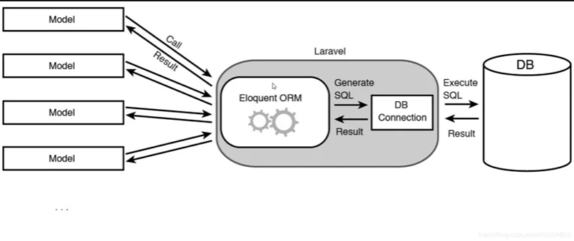

### blade
@isset($value) -------------- $endisset
@empty($value) -------------- $endempty
@switch($value) @case => code @endswitch

### ORM Object-Relational Mapping!

How to create Model
    php artisan make:model <ModelName>
how to create  Model with migration
    php artisan make:model <ModelName> -m
how to apply all pending database migrations to your application's database
    php artisan migrate

### Eloquent Relationship In Laravel

{--------------------------------------------------------------}
### One To One

example
namespace App\Models;

use Illuminate\Database\Eloquent\Model;

class User extends Model
{
    /**
     * Get the profile associated with the user.
     */
    public function profile()
    {
        return $this->hasOne(Profile::class);
    }
}

class Profile extends Model
{
    /**
     * Get the user associated with the profile.
     */
    public function user()
    {
        return $this->belongsTo(User::class);
    }
}

The relationship can be used like so:

$user = User::first(); 
$user->profile;
//returns the profile through a user

$profile = Profile::first();
$profile->user->id;
//returns the user id through the profile

// first() => returns a single model instance representing the first record found in the database table, or null if no record is found
{--------------------------------------------------------------}

### One To Many

Example of code  

namespace App\Models;

use Illuminate\Database\Eloquent\Model;

class Category extends Model
{
    /**
     * Get the posts associated with the category.
     */
    public function posts()
    {
        return $this->hasMany(Post::class);
    }
}

class Post extends Model
{
    /**
     * Get the category associated with the post.
     */
    public function category()
    {
        return $this->belongsTo(Category::class);
    }
}

The implemeted models can be used this way:

$category = Category::first();
$category->posts;
//returns the posts through a category

$post = Post::first();
$post->category->name;
//returns a category name through a post

{--------------------------------------------------------------}

{{-- Check If connected in Blade --}}
@auth
    <button>Logout</button>
@endauth

@guest
    <a href="/login">Login</a>
@endguest